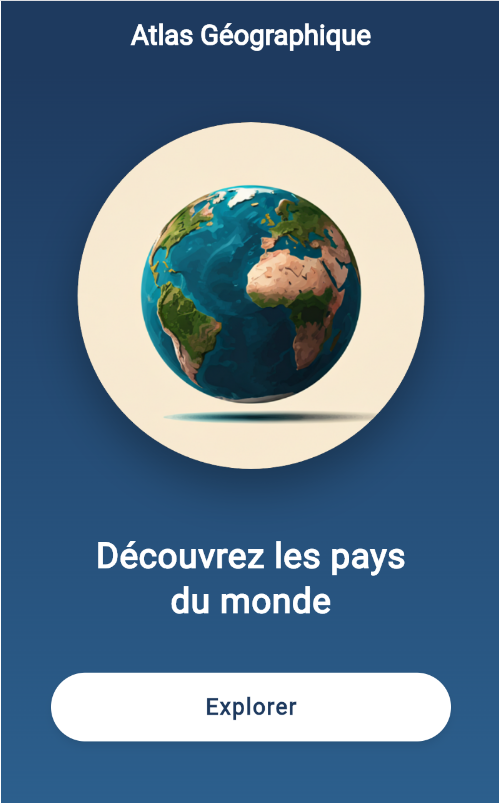
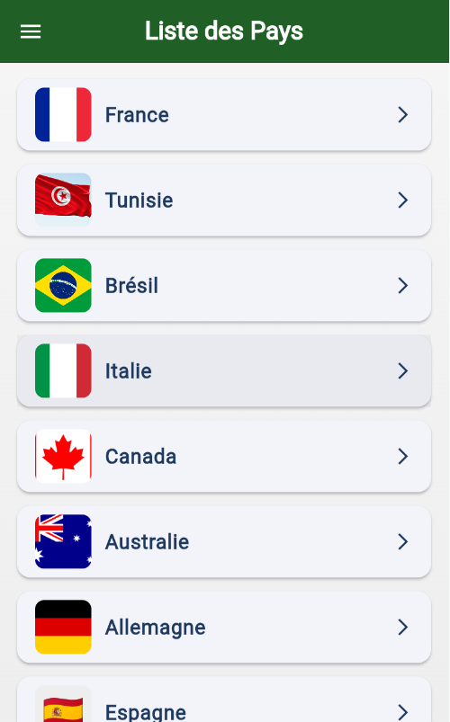
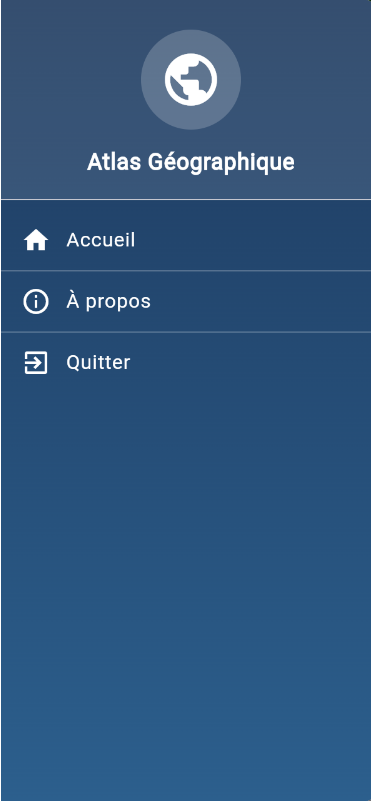
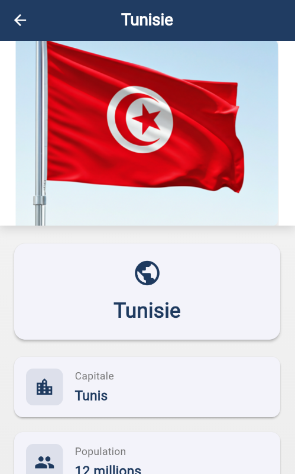

# Atlas Géographique

Une application mobile Flutter éducative permettant de découvrir les pays du monde entier avec leurs informations géographiques, démographiques et culturelles.

## 📱 Aperçu de l'Application

### Page d'Accueil


La page d'accueil présente :
- Un globe terrestre animé
- Le titre "Atlas Géographique"
- Un message de bienvenue : "Découvrez les pays du monde"
- Un bouton "Explorer" pour accéder à la liste des pays

### Liste des Pays


La page principale affiche :
- Une liste complète des pays disponibles
- Le drapeau de chaque pays (images PNG)
- Le nom de chaque pays
- Un menu latéral (Drawer) avec les options de navigation

### Menu Latéral (Drawer)


Le menu latéral contient :
- Icône du globe terrestre avec le titre "Atlas Géographique"
- Option "Accueil" - Retour à la page d'accueil
- Option "À propos" - Informations sur l'application
- Option "Quitter" - Fermeture de l'application

### Page de Détails d'un Pays


La page de détails affiche pour chaque pays :
- Le drapeau en grand format (image PNG)
- Le nom du pays
- 🏛️ **Capitale** : Ville capitale
- 👥 **Population** : Nombre d'habitants (en millions)
- 🗺️ **Superficie** : Superficie totale en km²
- 🗣️ **Langue(s) officielle(s)** : Langue(s) parlée(s)

## ✨ Fonctionnalités

### Écrans Principaux

1. **WelcomePage** (`welcome_page.dart`)
   - Page d'accueil avec image du globe
   - Navigation vers la liste des pays
   - Design avec dégradé bleu

2. **CountriesPage** (`countries_page.dart`)
   - Liste complète des pays avec drapeaux
   - Menu latéral (Drawer)
   - Navigation vers les détails de chaque pays
   - Option de quitter l'application

3. **CountryDetailPage** (`country_detail_page.dart`)
   - Affichage détaillé des informations d'un pays
   - Drapeau en grand format
   - Informations : capitale, population, superficie, langues

4. **AboutPage** (`about_page.dart`)
   - Informations sur l'application
   - Version de l'application
   - Crédits de développement

### Données des Pays

L'application contient les informations de **9 pays** :

| Pays | Capitale | Population | Superficie | Langue(s) |
|------|----------|-----------|-----------|-----------|
| 🇫🇷 France | Paris | 67 millions | 643 801 km² | Français |
| 🇹🇳 Tunisie | Tunis | 12 millions | 163 610 km² | Arabe |
| 🇧🇷 Brésil | Brasília | 215 millions | 8 515 767 km² | Portugais |
| 🇮🇹 Italie | Rome | 59 millions | 301 340 km² | Italien |
| 🇨🇦 Canada | Ottawa | 39 millions | 9 984 670 km² | Anglais |
| 🇦🇺 Australie | Canberra | 26 millions | 7 692 024 km² | Anglais |
| 🇩🇪 Allemagne | Berlin | 84 millions | 357 022 km² | Allemand |
| 🇪🇸 Espagne | Madrid | 47 millions | 505 990 km² | Espagnol |
| 🇿🇦 Afrique du Sud | Pretoria | 60 millions | 1 219 090 km² | Afrikaans |

## 🏗️ Structure du Projet

```
lib/
├── main.dart                      # Point d'entrée de l'application
├── models/
│   └── country.dart               # Modèle de données pour les pays
└── screens/
    ├── welcome_page.dart          # Page d'accueil
    ├── countries_page.dart        # Liste des pays
    ├── country_detail_page.dart   # Détails d'un pays
    └── about_page.dart            # Page À propos

assets/
└── images/
    ├── globe.png                  # Image du globe terrestre
    ├── Tunisia_Big.png            # Drapeau de la Tunisie
    ├── france-flag-large.png      # Drapeau de la France
    ├── brazil-flag-medium.png     # Drapeau du Brésil
    ├── italy.png                  # Drapeau de l'Italie
    ├── canada.png                 # Drapeau du Canada
    ├── australia.png              # Drapeau de l'Australie
    ├── germany.png                # Drapeau de l'Allemagne
    └── south_africa.png           # Drapeau de l'Afrique du Sud
```

## 🎨 Design et Interface

### Palette de Couleurs

- **Couleur principale** : Bleu foncé (#1E3A5F)
- **Couleur secondaire** : Bleu moyen (#2C5F8D)
- **Fond** : Gris clair (gradient)
- **Texte** : Blanc sur fond foncé, bleu foncé sur fond clair

### Composants UI

- **AppBar** : Barre de navigation avec titre et icône menu
- **Drawer** : Menu latéral avec navigation
- **Card** : Cartes pour afficher les informations
- **ListTile** : Éléments de liste cliquables
- **ElevatedButton** : Boutons d'action
- **Container** : Conteneurs avec dégradés et ombres

## 🛠️ Technologies Utilisées

- **Framework** : Flutter 3.9.2
- **Langage** : Dart
- **Architecture** : Widgets StatelessWidget
- **Navigation** : Navigator avec MaterialPageRoute
- **Assets** : Images PNG pour les drapeaux

## 📋 Prérequis

- Flutter SDK 3.9.2 ou supérieur
- Dart SDK
- Android Studio / VS Code
- Un émulateur ou appareil physique

## 🚀 Installation et Lancement

### 1. Cloner le projet

```bash
git clone <url-du-projet>
cd atlas_geo_boubaker
```

### 2. Installer les dépendances

```bash
flutter pub get
```

### 3. Lancer l'application

```bash
# Sur un émulateur ou appareil connecté
flutter run

# Sur Windows
flutter run -d windows

# Sur Android
flutter run -d android

# Sur iOS (Mac uniquement)
flutter run -d ios
```

### 4. Compiler l'application

```bash
# Android APK
flutter build apk

# Android App Bundle
flutter build appbundle

# iOS
flutter build ios

# Windows
flutter build windows
```

## 📂 Modèle de Données

### Classe Country

```dart
class Country {
  final String nom;           // Nom du pays
  final String flag;          // Emoji du drapeau
  final String capitale;      // Capitale
  final String population;    // Population (format: "XX millions")
  final String superficie;    // Superficie (format: "XXX XXX km²")
  final String langues;       // Langue(s) officielle(s)
}
```

## 🎯 Fonctionnalités Clés

### Navigation

- Navigation avec `Navigator.push()` pour avancer
- Navigation avec `Navigator.pushReplacement()` pour remplacer
- Bouton retour automatique dans l'AppBar
- Menu Drawer pour navigation globale

### Affichage des Images

- Drapeaux en images PNG (meilleure qualité que les emojis)
- Images chargées depuis le dossier `assets/images/`
- Fallback sur emoji si l'image n'existe pas

### Gestion des Assets

Toutes les images sont déclarées dans `pubspec.yaml` :

```yaml
flutter:
  assets:
    - assets/images/
```

## 🐛 Résolution de Problèmes

### Les images ne s'affichent pas

1. Vérifier que les images sont dans `assets/images/`
2. Exécuter `flutter clean`
3. Exécuter `flutter pub get`
4. Redémarrer l'application (pas de hot reload)

### Erreurs de compilation

```bash
flutter clean
flutter pub get
flutter run
```

## 📝 Améliorations Futures

- [ ] Ajouter plus de pays (tous les pays du monde)
- [ ] Ajouter une barre de recherche
- [ ] Ajouter un système de favoris
- [ ] Ajouter des cartes géographiques
- [ ] Ajouter des informations sur la monnaie
- [ ] Ajouter le fuseau horaire
- [ ] Mode sombre / clair
- [ ] Multi-langue (FR/EN/AR)
- [ ] Animation des transitions
- [ ] Persistance des données avec SQLite

## 👨‍💻 Développement

### Structure du Code

- **Séparation des responsabilités** : Modèles, vues, données séparés
- **Code réutilisable** : Widgets et fonctions helpers
- **Navigation claire** : Routes bien définies
- **Design responsive** : Adaptation aux différentes tailles d'écran

### Conventions de Code

- Nommage en français pour les classes métier
- Commentaires en français
- Indentation : 2 espaces
- Format : `dart format lib/`

